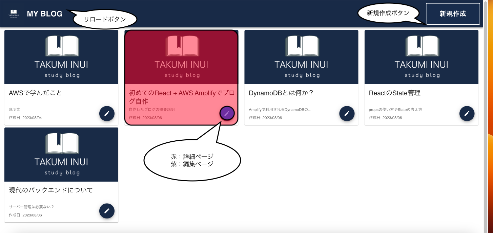
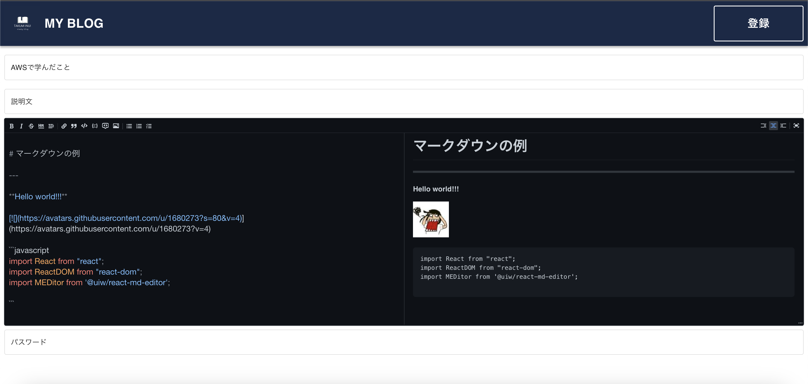
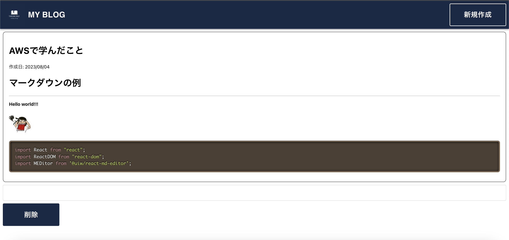

# ブログ作成

コーディング能力向上のため、ブログを作成した。その過程と結果をまとめる。ここでは、細かい学びではなく、大まかな学びについてまとめる。

- [ブログ作成](#ブログ作成)
  - [制作物](#制作物)
  - [目的](#目的)
  - [使用技術](#使用技術)
  - [学び](#学び)
  - [NextToDo](#nexttodo)
  - [参考](#参考)

## 制作物

作成したのは[**個人用ブログ**](https://main.d2wfepcu9vhsfm.amplifyapp.com/)である。本ブログの機能は、主に４つある。

1. ブログを一覧で閲覧できる/Users/ivm-2023-01/Desktop/Memo/画像/技術/ブログ\_メイン.png
2. ブログを投稿できる
3. ブログを編集できる
4. ブログを削除できる

この４つを実装した。下の画像が、ホーム画面である。この画面では、機能 1 を実現している。

メイン画面と編集画面と詳細画面に遷移可能。本ブログは、Markdown 記法を用いる。そのため、編集ページには、編集部分とプレビュー部分を実装する。

新規作成では、デフォルトでブログのタイトルと説明文と本文にそれぞれ"タイトル", "説明文" , "マークダウン..."が入っている。各ブログの編集ボタンから遷移する場合、各タイトルと説明文と本文がそれぞれ入っている。そして、パスワードを入れて、登録ボタンを押すと、投稿と編集ができる。よって、機能 2,3 を実現している。

詳細画面ではブログの詳細を見れるほかに、削除ができる。パスワードをいれ、削除ボタンを押すと削除できる。

## 目的

このプロジェクトの目的は、React と AWS(Amazon Web Service)の知識の習得と向上である。特に AWS のクラウド知識を高めることを目的にする。手を動かしながら、クラウド知識を学ぶ。

## 使用技術

使用した技術は、

- React
- Amplify(AWS)

である。Web アプリケーションの作成にした理由は、主に二つである。

1. 手元のスマートフォンやパソコンで動かせる
2. 参考のブログアプリケーションが多い

React を選んだ理由は、副業とかにも活かしやすいと考えためである。多くの人・会社が使っている技術であることから情報が多くあることも推測できる。Java Script 系であり、最新で汎用的な技術を採用した。

AWS/GCP/Azure の中から AWS を選んだ理由は、会社の提携先であり多くのサービスが AWS 上で動いているからである。

## 学び

- 調べる技術が重要
  - 英語は勉強するべき
- 次に活かせるように、学びは定期的にまとめる
- 細部を気をつけるのは難しい

AWS などの最新技術は、説明記事などが多くあるが、参考程度である。一番重要なのは AWS 自身が出しているドキュメントである。ブログの実装時にも、GraphQL でデータを実装できるという説明記事や AWS の記事があった。しかし、結局 GraohQL は使えなかった。バックエンドをいじるページに書いてある情報を読み、解決する必要があった。各ページは適宜更新される。調べる能力が重要だとわかった。

そして、ドキュメントは英語であり、技術用語がバンバン出てくる。ビルド・デプロイ・CI/CD など、多くの言葉の知識が必要である。英語がわかると、最新技術の理解が早まると感じた。

不明点を調べながらコードを書いていると、分からなかったところを忘れることが多々ある。その結果、物はできたけど、何も学べていない・次に活かせないということが起こる。そのため、不明点とその解決法、調べるべきことをまとめておくべきである。

細部に気をつけるようにしたが、コンポーネントの大きさや位置の調節だけでなく、遷移制御や画面入力は難しいと感じた。パスワードをいつどこでどのように求めるのかなや、どこをタッチするとどこへ推移するのかなど考えるべきことは多い。入力ならば入力キーを数字だけにするか、入力をマスクするのかなど、選択肢も多い。細部は UX に直結するため、実装コストを減らして、簡単に変更できるようにしたい。

## NextToDo

次に行いたいのは、次の 3 点。

- React の技術を上げる
  - RiverPod 的な状態をグローバルに保管する方法
  - Hooks について勉強する
- AWS の知識を向上させる
  - Python と AWS を使って、スクレイピングを定期実行する
  - AWS の資格勉強
- LLM を使ったサービスの作成
  - LLM のオープンソースの実装を自分でも行う

> 特定の分野のプロフェッショナルとは、その分野で一通りのミスを経験した人のこと

自分で手を動かし自分で知らないこと・分からないことをまとめながら全てを学びとし、プロフェッショナルになれるようにしていきたい。

## 参考

- [ブログ](https://main.d2wfepcu9vhsfm.amplifyapp.com/)
- [GitHub](https://github.com/inuit0215/my_blog)
